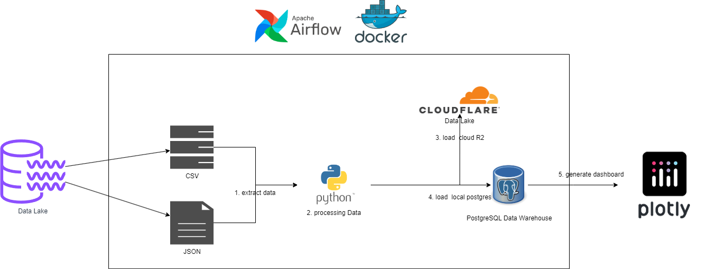
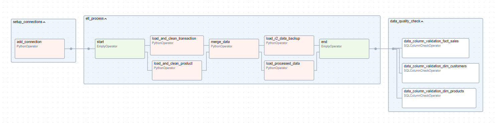
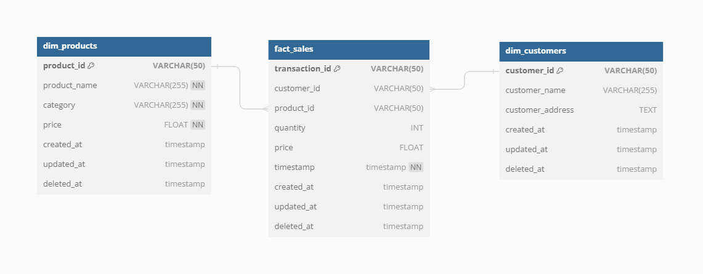
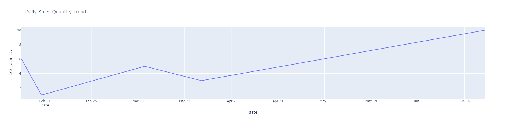
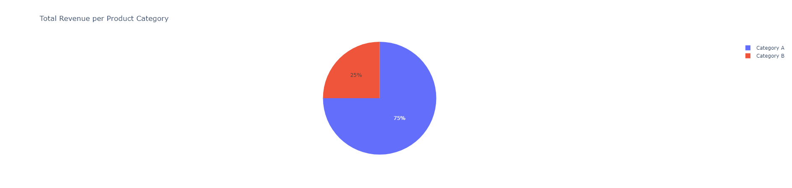

# ShopSmart Data Pipeline


## **Overview**

This pipeline is designed for an interview process and involves collecting data from CSV and JSON files. The data is processed and stored in a PostgreSQL data warehouse and a Cloudflare R2 data lake. Airflow is used for orchestration and is hosted locally with Docker Compose. PostgreSQL is also running locally in a Docker container. The data dashboard is run locally using Plotly.

### Tools & Technologies

- Containerization - [**Docker**](https://www.docker.com), [**Docker Compose**](https://docs.docker.com/compose/)
- Orchestration - [**Airflow**](https://airflow.apache.org)
- Data Lake - [**Cloudflare R2 Storage**](https://dash.cloudflare.com/)
- Data Warehouse - [**PostgreSQL**](https://www.postgresql.org/)
- Data Visualization - [**Plotly**](https://plotly.com/)
- Language - [**Python**](https://www.python.org)


## **Architecture**


## **ETL** 


## **Data Warehouse - Postgres**

Go to Database design [**dbdocs.io**](https://dbdocs.io/ztamnaja/shopsmart?view=relationships)




## **Data Dashboard**





## Setup

Follow the steps below to set up the pipeline. I've tried to explain the steps where possible.

First clone the repository into your home directory and follow the steps.

  ```bash
  git clone git@github.com:ztamnaja/shopsmart-data-pipeline.git
  cd shopsmart-data-pipeline
  ```

### Step 1: Create .env and connections.json File
create file .env and connections.json for setup airflow connection with postgrestSQL and Cloudflare R2 Storage

Create a file named .env in the root directory of the project with the following content:
```bash
AIRFLOW_DB_PASSWORD=
AIRFLOW_DEFAULT_WWW_USER=
AIRFLOW_DEFAULT_WWW_USER_PASSWORD=
AIRFLOW_DEFAULT_WEBSERVER=
AIRFLOW_DEFAULT_WEBSERVER_PASSWORD=
DESTINATION_DB_NAME=
DESTINATION_DB_USER=
DESTINATION_DB_PASSWORD=
DESTINATION_DB_HOST=
DESTINATION_DB_PORT=
```

Create a file named connections.json in the root directory of the project with the following content:

```bash
{
  "destination_db_conn": {},
  "r2_backup_lake_conn": {}
}
```

### Step 2: Start Docker
Start Docker by running the following command:

  ```bash
  docker-compose up
  ```

### Step 3: Trigger ETL Process
Trigger the ETL process from the Airflow UI. Using airflow user and password from .env file

  
### Step 4: Run ShopSmart Dashboard
After triggering the ETL process, you can run the ShopSmart Dashboard via the bash script. This will allow you to download the sales data report in PDF and CSV formats.

  ```bash
  ./run_dashboard.sh
  ```
You can access demo ShopSmart Dashboard on http://127.0.0.1:8050

